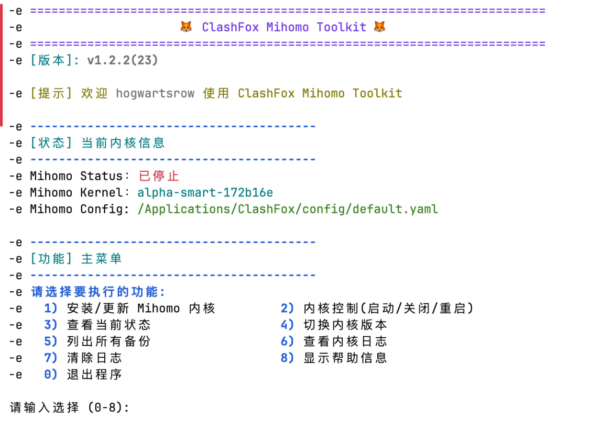
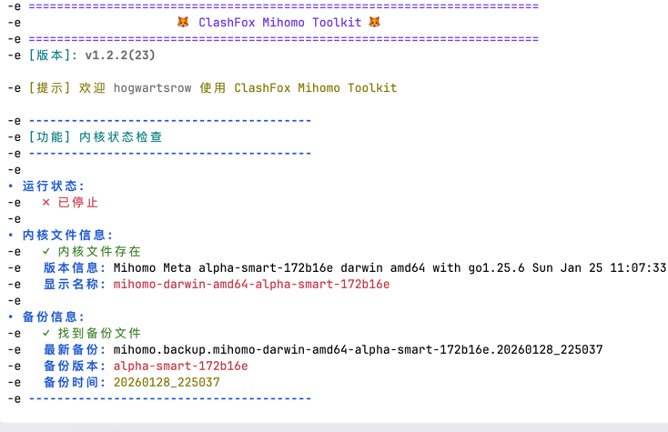
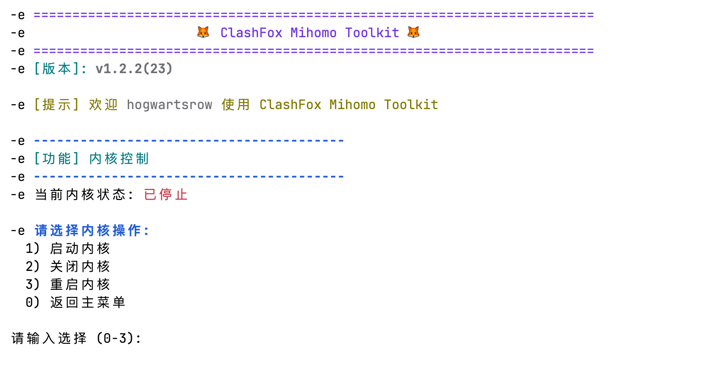

<div align="center">
  
</div>

# ClashFox-Mihomo-Toolkit

一个功能强大的 ClashFox Mihomo 内核管理工具集，提供完整的内核安装、配置、运行和监控功能。

## ⚡️一键安装

```bash
bash -c 'set -e; t=$(mktemp -t clashfox_mihomo_toolkit); echo "正在下载 ClashFox Mihomo Toolkit..."; curl -fL --progress-bar "https://raw.githubusercontent.com/lukuochiang/ClashFox-Mihomo-Toolkit/refs/heads/main/scripts/clashfox_mihomo_toolkit.sh" -o "$t"; echo "正在安装内核..."; chmod +x "$t" && "$t"; echo "清理临时文件..."; rm -f "$t"; echo "安装完成！"'
```
### 目录说明

- /Applications/ClashFox/ # 根目录
- **core/**: 存放所有 Mihomo 内核文件，包括当前活动内核、不同版本的内核文件以及自动生成的备份文件。
- **config/**: 存放配置文件，默认使用 `default.yaml`。
- **data/**: 存放 Mihomo 运行时产生的数据文件和缓存。
- **logs/**: 存放内核运行日志，便于排查问题和监控运行状态。
- **runtime/**: 存放运行时相关文件，如进程ID文件，用于管理内核进程。

## 💡功能特性

### 🔧 内核管理
- **安装/更新内核**：支持从多个 GitHub 源（vernesong/MetaCubeX）下载最新版本
- **自动架构检测**：智能识别系统架构（arm64/amd64）
- **版本切换**：灵活切换不同版本的内核
- **智能备份**：自动按时间戳备份历史版本
- **备份管理**：查看和管理所有备份版本

### 📊 状态监控
- **实时状态显示**：显示内核运行状态、版本信息
- **日志管理**：查看内核日志、定期清理日志
- **配置检查**：检测配置文件状态

### 🎛️ 进程控制
- **启动/关闭**：控制内核进程的运行状态
- **重启内核**：快速重启内核以应用配置
- **PID管理**：通过PID文件确保进程安全控制

### 📁 目录管理
- **自动创建目录**：确保完整的目录结构存在
- **权限设置**：自动设置正确的目录权限
- **文件组织**：合理管理配置、日志、数据等文件

## 系统要求

- macOS 操作系统
- bash shell 环境
- curl 命令（用于下载内核）
- sudo 权限（用于目录创建和权限设置）

## 安装说明

1. 克隆仓库到本地：

```bash
git clone https://github.com/yourusername/ClashFox-Mihomo-Toolkit.git
cd ClashFox-Mihomo-Toolkit
```

2. 赋予脚本执行权限：

```bash
chmod +x scripts/clashfox_mihomo_toolkit.sh
```

3. 运行脚本：

```bash
./scripts/clashfox_mihomo_toolkit.sh
```

## 📸 预览截图

### 主菜单界面



### 状态监控界面



### 内核管理界面



### 日志查看界面


## 常见问题

### 1. 安装失败怎么办？
- 检查网络连接是否正常
- 确保有足够的磁盘空间
- 检查是否有sudo权限
- 查看错误信息并根据提示解决

### 2. 内核无法启动怎么办？
- 检查配置文件是否正确
- 查看日志文件了解具体错误
- 确保端口未被占用
- 尝试重启系统后再试

### 3. 如何更新工具本身？
- 重新运行一键安装命令
- 或从GitHub仓库克隆最新版本

### 4. 如何手动备份配置？
配置文件位于 `/Applications/ClashFox/config/default.yaml`，可以手动复制此文件进行备份。

## 许可证

本项目采用 MIT 许可证 - 查看 [LICENSE](LICENSE) 文件了解详情。

## 致谢

特别感谢以下项目和开发者：
- [MetaCubeX/mihomo](https://github.com/MetaCubeX/mihomo)
- [vernesong/mihomo](https://github.com/vernesong/mihomo)

---

**ClashFox-Mihomo-Toolkit** - 让 Mihomo 内核管理变得简单高效！